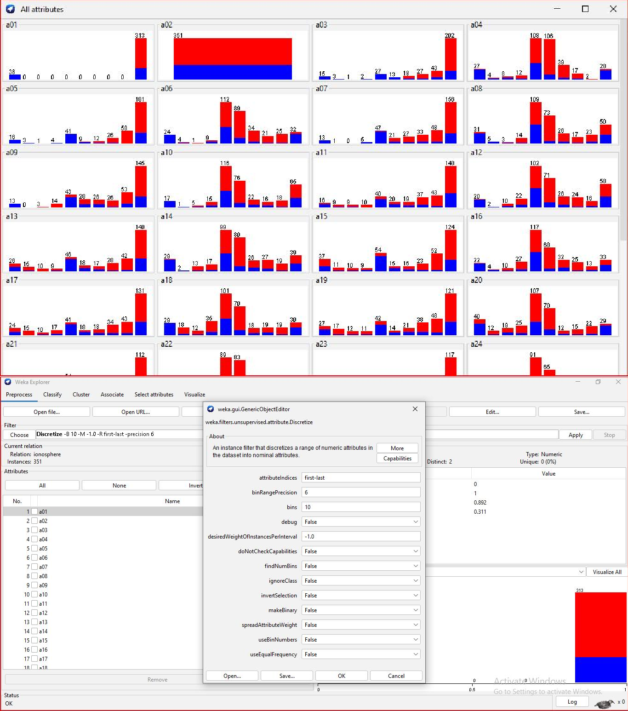
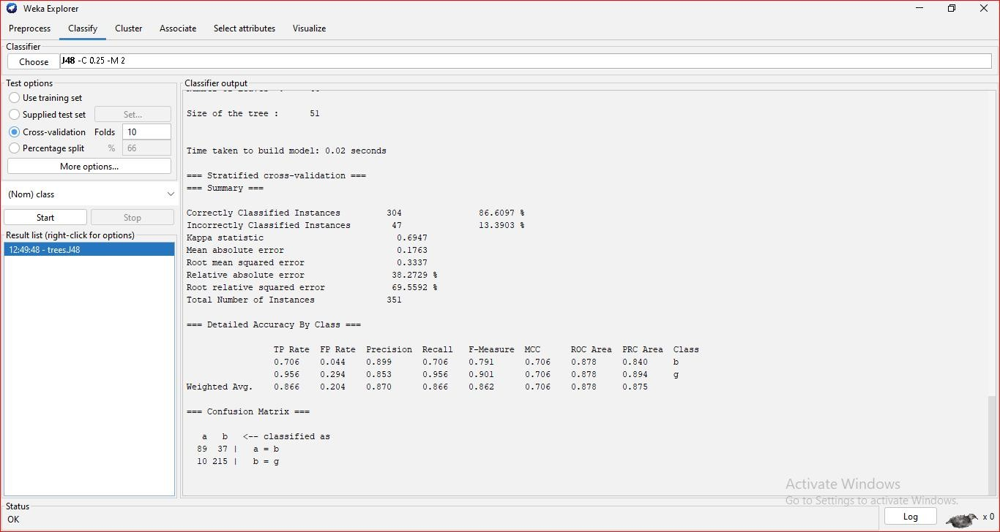

Practical 02

Aim:
Demonstration on discretizing the attribute on the training dataset (ionosphere) and comparing it with different binning values and equal frequency binning.

Objective:
• Understand the concept of data discretization  
• Learn how continuous data can be converted into discrete intervals  
• Analyze the effect of different binning techniques  
• Compare equal-width and equal-frequency discretization methods  

Software and Hardware Requirements:

Hardware:
Computer or Laptop (minimum 4GB RAM)

Software:
Windows/Linux/macOS  
WEKA Tool (Java/JDK installed)

Theory:

Data discretization is an important preprocessing technique in data mining and machine learning. It involves converting continuous numerical attributes into discrete intervals or categories. This helps simplify data analysis and improves model performance.

Continuous data is measured, while discrete data is counted. Discretization reduces complexity by grouping large ranges of values into bins.

There are two types of discretization:

Supervised Discretization:
Uses class label information for creating intervals.

Unsupervised Discretization:
Does not use class labels and relies on statistical properties.

Two commonly used techniques:

Equal-Width Discretization:
The range of values is divided into equal-sized intervals.

Equal-Frequency Discretization:
Each interval contains approximately the same number of data points.

Description:

In this practical, the ionosphere dataset available in WEKA is used. The dataset contains continuous attributes which are transformed into discrete values using WEKA filters.

The following steps are performed:

• Load ionosphere dataset in WEKA Explorer  
• Apply Discretize filter  
• Use Equal-Width binning with different number of bins  
• Apply Equal-Frequency binning  
• Compare results using classifier (J48)  

Screenshots:

Original Dataset:

Equal Width Discretization:

Equal Frequency Discretization:

Conclusion:

Thus, discretization helps in simplifying continuous data into meaningful intervals. It improves model interpretability and can enhance classification performance. Equal-width and equal-frequency binning produce different results and must be selected based on dataset characteristics.

Tool Used:
WEKA Explorer

Note: This practical was implemented and documented by Tisha Mondal.
